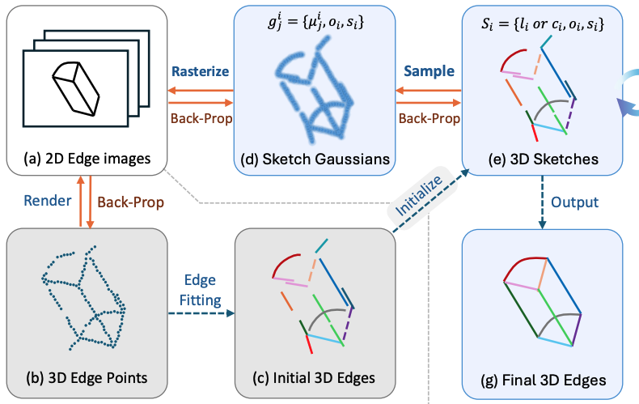
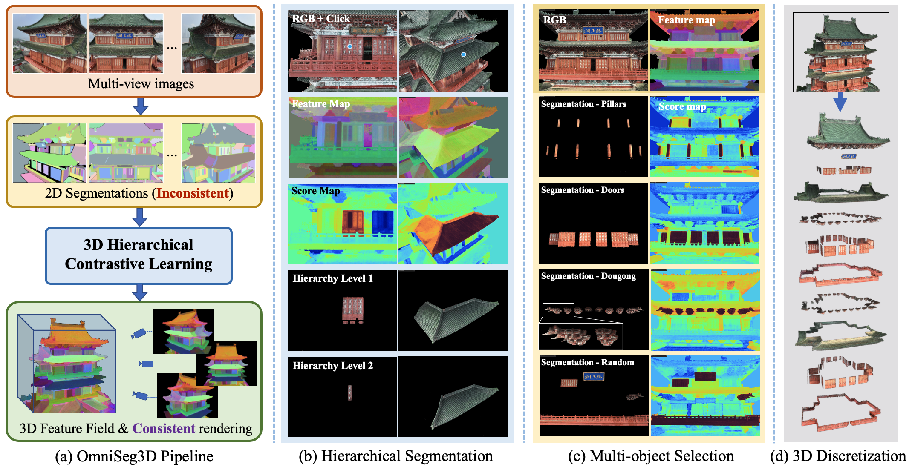

# About Me
I'm now a first-year PhD student in computer science at the University of Maryland (College Park), working with [Prof. Matthias Zwicker](https://www.cs.umd.edu/~zwicker/).
Before that, I got my master's degree in Data Science and Information Technology at TBSI, Tsinghua University(THU), supervised by [Prof. Lu Fang](https://luvision.net) and [Prof. Qionghai Dai](https://scholar.google.com/citations?user=CHAajY4AAAAJ&hl=zh-CN&oi=ao). Prior to that, I spent wonderful 4 years at Sun Yat-Sen University(SYSU), <!-- advised by [Prof. Yulan Guo](http://www.yulanguo.cn/)--> and obtained my bachelor's degree in 2021. 

**My research interests mainly lie in 3D computer vision**, especially in:
* 3D Representation: Geometric Primitive based 3D Modeling (such as Quadrics and CAD)
* 3D Reconstruction: Semantic-aware Reconstruction and Rendering from images and video
* 3D Understanding: Hierarchical 3D Scene Parsing and Navigation
<!-- * **3D Scene Generation** -->

My goal is ***to model, reconstruct, and manipuate the 3D world in a more efficient and interpretable manner***.

<!-- Collaborations and casual chats are welcomed! -->

---

# News
* [Feb. 2024] Our paper [**OmniSeg3D**](https://oceanying.github.io/OmniSeg3D/) is accepted by **CVPR 2024** and [**code**](https://github.com/THU-luvision/OmniSeg3D) is available now!
* [July. 2023] Our paper [**PARF**](https://oceanying.github.io/PARF/) is accepted by **ICCV 2023**!
* [July. 2022] Our paper [**ParseMVS**](https://dl.acm.org/doi/10.1145/3503161.3547920) is accepted by **ACM MM 2022**!

---

# Publications

<table><tr>
<td valign="top">  </td>
<td>            
                
<b>SketchSplat: 3D Edge Reconstruction via Differentiable Multi-view Sketch Splatting</b>  

		<b>Haiyang Ying</b>, Matthias Zwicker&dagger;
		
(CVPR 2024) 

                
 
			[<a href="https://arxiv.org/abs/2503.14786">ArXiv</a>]
			[<a>Code(coming soon)</a>] 
		

</td>
</tr>

<table><tr>
<td valign="top">  </td>
<td>            
                
<b>OmniSeg3D: Omniversal 3D Segmentation via Hierarchical Contrastive Learning</b>  

		<b>Haiyang Ying</b>, Yixuan Yin, Jinzhi Zhang, Fan Wang, Tao Yu, Ruqi Huang, Fu Fang&dagger;
		
(CVPR 2024) 

                
 
			[<a href="https://arxiv.org/abs/2311.11666">ArXiv</a>]
			[<a href="https://oceanying.github.io/OmniSeg3D/">Project Page</a>]
			[<a href="https://github.com/THU-luvision/OmniSeg3D">Code</a>] 
		

</td>
</tr>

<tr>
<td valign="top">  </td>
<td>            
                
<b>PARF: Primitive-Aware Radiance Fusion for Indoor Scene Novel View Synthesis</b>  

		<b>Haiyang Ying</b>, Baowei Jiang, Jinzhi Zhang, Di Xu, Tao Yu&dagger;, Qionghai Dai, Fu Fang&dagger;
		
The International Conference on Computer Vision (ICCV) 2023 

                
 
			[<a href="https://arxiv.org/abs/2309.17190">ArXiv</a>]
			[<a href="https://openaccess.thecvf.com/content/ICCV2023/papers/Ying_PARF_Primitive-Aware_Radiance_Fusion_for_Indoor_Scene_Novel_View_Synthesis_ICCV_2023_paper.pdf">Paper</a>]
			[<a href="https://oceanying.github.io/PARF/">Project Page</a>]
			[<a>Code(coming soon)</a>] 
		

</td>
</tr>

<tr>
<td valign="top">  </td>
<td>            
                
<b>ParseMVS: Learning Primitive-aware Surface Representations for Sparse Multi-view Stereopsis</b>  

		<b>Haiyang Ying&#42;</b>, Jinzhi Zhang&#42;, Yuzhe Chen, Zheng Cao, Jing Xiao, Ruqi Huang&dagger;, Fu Fang&dagger;
		
The 30th ACM International Conference on Multimedia (ACM MM 2022) 

                
 [<a href="https://doi.org/10.1145/3503161.3547920">Paper</a>][<a href="https://oceanying.github.io">Code</a>] 

</td>
</tr></table>

---

# Research Experiences

* **Semantic-Aware Indoor Scene Reconstruction and Rendering**
*Sep. 2022 – May. 2023*
Propose a semantic-aware hybrid representation for indoor scene modeling.  
Design a framework for fast indoor scene reconstruction and rendering with RGB-D input.  
Implement the proposed framework based on Instant-NGP to achieve higher-quality rendering.  
Mentor: [Prof. Lu Fang](https://luvision.net) and [Tao Yu](http://ytrock.com)

* **Semantic-Aware Sparse View 3D Reconstruction**
*Sep. 2021 – Aug. 2022*  
Propose a semantic-based representation to encode geometry, texture, and visibility on primitives.  
Design a pipeline for multi-view 3D reconstruction under sparse observations.  
Explore the capacity of implicit function for local representation and optimization.  
Mentor: [Prof. Lu Fang](https://luvision.net) and [Prof. Ruqi Huang](https://scholar.google.com/citations?user=cgRY63gAAAAJ&hl=zh-CN&oi=ao)

* **Dynamic Vascular 3D Reconstruction (B.S. Thesis)**
*Oct. 2020 – Aug. 2021*  
Propose to model 3D dynamic tissue with implicit representation.  
Design a pipeline for 3D reconstruction with multi-view cone beam CT images.  
Mentor: [Prof. Lu Fang](https://luvision.net) <!-- and [Prof. Yulan Guo](https://scholar.google.com/citations?hl=zh-CN&user=WQRNvdsAAAAJ&view_op=list_works&sortby=pubdate) -->

---

# Education

* **Ph.D. student, Computer Science**  
*Sept. 2024 - Present*, University of Maryland (College Park), US.
* **M.Phil., Data Science and Information Technology**  
*Sept. 2021 - Jun. 2024*, Tsinghua University, China.
* **B.Eng., Electronic Information Science and Technology**  
*Sept. 2017 - Jun. 2021*, Sun Yat-Sen University, China.

<!--
<table>
<tr>
	<td>  </td>
	<td>            
		
<b>Tsinghua University</b>  

		
M.Phil., Data Science and Information Technology 

		
Sept. 2021 - Present, Beijing, China. 

		
Advisors: Prof. <a href="https://luvision.net">Lu Fang</a> and Prof. <a href="https://scholar.google.com/citations?user=CHAajY4AAAAJ&hl=zh-CN&oi=ao">Qionghai Dai</a> 

	</td>
</tr>

<tr>
	<td> 
		 
	</td>
	<td>            
		
<b>Sun Yat-sen University</b>  

		
B.Eng., Electronic Information Science and Technology

		
Sept. 2017 - Jun. 2021, Guangzhou, China.

		
Advisor: Prof. <a href="http://www.yulanguo.cn/">Yulan Guo</a>

	</td>
</tr>
</table>
-->

---

# Honors & Awards
* *2021*, Excellent Graduate, Sun Yat-Sen University.
* *2019, 2020*, National Scholarship, the Minister of Education, China.
* *2018*, 1nd Prize, College Electronic Design Competition, Guangdong, China.
* *2018, 2019, 2020*, Excellence Student the 1st-class Scholarship, Sun Yat-Sen University.
* *2018*, AEON Scholarship, Sun Yat-Sen University.

<!--
# Academic Services
* Reviewer: ICCV, CVPR, ICASSP, ICIP, EUSIPCO.
* Volunteer: ICML, NeurIPS.
* Membership: EURASIP, IEEE, IEEE SPS, IEEE YP, ACM.
-->

---

# Teaching Experiences
* ***Fall 2022*, Teaching Assistant, Tsinghua University.**  
Course: Media and Cognition (English)

* ***Fall 2023*, Teaching Assistant, Tsinghua University.**  
Course: Machine Vision (English)

---

<!--  -->

<!--  -->
