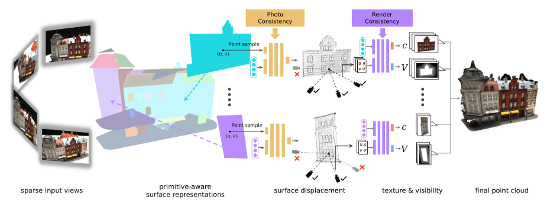

<!-- 
  You can also find my articles on <u><a href="{{author.googlescholar}}">my Google Scholar profile</a>.</u>
 -->



<!-- 
  
 -->

(&#42;: Equal Contribution, &dagger;: Corresponding Author.)

<!-- # Conference -->

## 2023

**PARF: Primitive-Aware Radiance Fusion for Indoor Scene Novel View Synthesis**  
  **Haiyang Ying**, Baowei Jiang, Jinzhi Zhang, Di Xu, Tao Yu&dagger;, Qionghai Dai, Fu Fang&dagger;.  
  *Proceedings of the IEEE International Conference on Computer Vision 2023.*  
  (ICCV 2023)
  

---

## 2022

**ParseMVS: Learning Primitive-aware Surface Representations for Sparse Multi-view Stereopsis**  
  **Haiyang Ying**&#42;, Jinzhi Zhang&#42;, Yuzhe Chen, Zheng Cao, Jing Xiao, Ruqi Huang&dagger;, Fu Fang&dagger;.  
  *The 30th ACM International Conference on Multimedia.*  
  (ACM MM 2022) [[Paper](https://doi.org/10.1145/3503161.3547920)]
  
  

<!--
### Journal
* **LiDAR Integrated IR OWC System with Abilities of User Localization and High-Speed Data Transmission.**  
  Zhi Li, **Yicong Li**, Zihan Zang, Mutong Li, Yaqi Han, Lican Wu, H. Y. Fu&#42;.  
  *Optics Express, 2022.* [[Paper](https://doi.org/10.1364/OE.454266)]
-->
